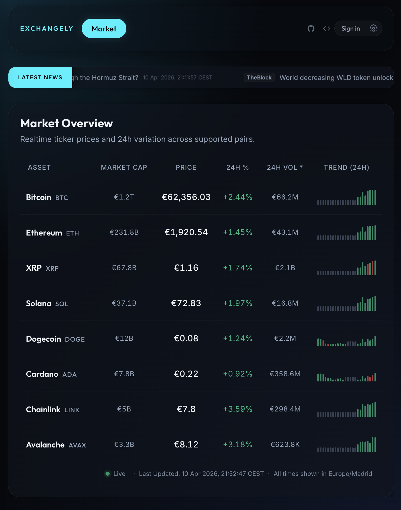
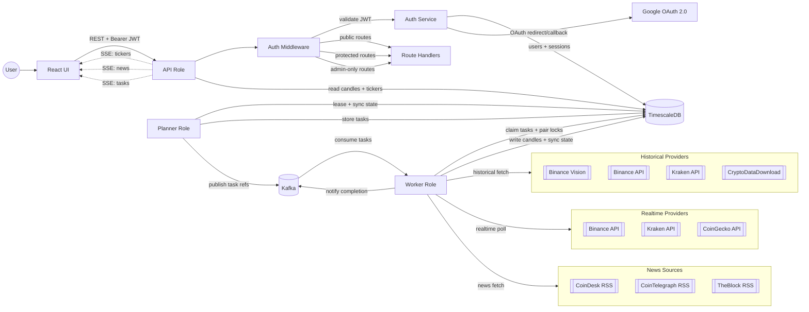

# Exchangely

> [!NOTE]
> This project is being built for educational purposes only. It is not intended for use in any production environment.

Started as a "poor man's CoinGecko" for historical data availability Exchangely is an event-driven crypto market data platform focused on historical OHLCV coverage for curated crypto/fiat and crypto/stablecoin pairs.

## Features

- **Real-time Market Dashboard** — Live prices, 1h/24h/7d variation, 24h volume, high/low, market cap, and trend sparklines for all tracked pairs. Updates via SSE with no polling.
- **Historical OHLCV Data** — Automated backwards backfill from multiple providers with hourly and daily resolution. REST API with interval, start/end time filtering.
- **Multi-Source Aggregation** — Five data providers (Binance, Binance Vision, Kraken, CoinGecko, CryptoDataDownload) with automatic cross-source consolidation and integrity checks.
- **Market News Feed** — Horizontal scrolling ticker with curated crypto news from CoinDesk, Cointelegraph, and TheBlock RSS feeds, refreshed every 5 minutes.
- **Operations Center** — Three-tab admin panel: system health warnings, coin-grouped coverage view (live feed health + backfill status per base asset in collapsible cards), and task audit log. All SSE-driven.
- **Event-Driven Task Engine** — Planner/worker architecture with Kafka-distributed tasks, DB-backed leader election, per-pair advisory locks, and configurable throughput controls.
- **Data Integrity** — Gap validation, cross-source integrity checks, daily backfill probes, and automatic task cleanup with configurable retention.

## Architecture

Exchangely runs as a single Go binary (with a React static frontend on top) with three roles that can be enabled independently via `BACKEND_ROLE`:

| Role | Responsibility |
|------|---------------|
| **Planner** | Acquires a DB-backed lease for leadership, reads sync state, and schedules tasks (backfill, realtime, consolidation, cleanup, news, integrity checks). Publishes task references to Kafka. |
| **Worker** | Claims tasks from Kafka, acquires per-pair advisory locks in PostgreSQL, fetches data from external providers, consolidates candles, and writes results to TimescaleDB. |
| **API** | Serves REST endpoints and SSE streams. Reads from TimescaleDB and pushes live updates to connected clients. |

### Data Flow

Historical backfill and live ticker are intentionally decoupled:

- **Historical backfill** walks backwards from yesterday into the past (no fixed start date), so charts are useful immediately. A daily probe extends each pair one hour further to discover newly available upstream data.
- **Live ticker** starts immediately per pair with at most one task in the queue at a time. Once a worker completes a ticker poll, the next planner tick re-enqueues it.
- **Consolidation** aggregates raw samples into hourly candles, then hourly into daily.

### Data Providers

#### Crypto

| Provider | Historical | Realtime | Method |
|----------|:----------:|:--------:|--------|
| Binance | ✓ | ✓ | REST OHLC + `/ticker/24hr` |
| Binance Vision | ✓ | | Bulk CSV archives |
| Kraken | ✓ | ✓ | REST OHLC + `/Ticker` |
| CoinGecko | | ✓ * | `/simple/price` |
| CryptoDataDownload | ✓ | | Hourly/daily CSV |

\* Requires separate API key for the provider

#### News 

News are ingested from CoinDesk, Cointelegraph, and TheBlock RSS feeds.

## Running Exchangely

> [!NOTE]
> There is no pre-built image to run the platform at this point. You must run build your own docker files.

1. Copy `.env.example` to `.env` and adjust values if needed
2. Run `docker compose up --build`.
3. Open the frontend at `http://localhost:5173`.
4. Open the backend API at `http://localhost:8080/api/v1/health`.

### Configuration

All settings are controlled via environment variables. Override them in `.env` or `docker-compose.yml`.

#### Core

| Variable | Description | Default |
|----------|-------------|---------|
| `BACKEND_ENV` | Runtime environment (`development`, `production`) | `development` |
| `BACKEND_HTTP_ADDR` | HTTP listen address | `:8080` |
| `BACKEND_ROLE` | Comma-separated roles: `api`, `planner`, `worker`, or `all` | `all` |
| `BACKEND_LOG_LEVEL` | Log verbosity (`debug`, `info`, `warn`, `error`) | `info` |
| `BACKEND_CORS_ALLOWED_ORIGINS` | Comma-separated allowed CORS origins | `localhost:5173` (dev) |

#### Database & Messaging

| Variable | Description | Default |
|----------|-------------|---------|
| `BACKEND_DATABASE_URL` | TimescaleDB/PostgreSQL connection string | _(required)_ |
| `BACKEND_KAFKA_BROKERS` | Comma-separated Kafka broker addresses | _(required)_ |
| `BACKEND_KAFKA_TOPIC_TASKS` | Kafka topic for task distribution | `exchangely.tasks` |
| `BACKEND_KAFKA_TOPIC_MARKET_TICKS` | Kafka topic for market events | `exchangely.market.ticks` |
| `BACKEND_KAFKA_CONSUMER_GROUP` | Kafka consumer group name | `exchangely-workers` |

#### Planner

| Variable | Description | Default |
|----------|-------------|---------|
| `BACKEND_PLANNER_LEASE_NAME` | DB lease name for leader election | `planner_leader` |
| `BACKEND_PLANNER_LEASE_TTL` | Leader lease time-to-live | `15s` |
| `BACKEND_PLANNER_TICK` | Planner scheduling loop interval | `10s` |
| `BACKEND_PLANNER_BACKFILL_BATCH_PERCENT` | % of worker batch size allocated to backfill per planner tick | `50` |
| `BACKEND_REALTIME_POLL_INTERVAL` | How often the planner emits realtime ticker tasks per pair | `5s` |

#### Worker

| Variable | Description | Default |
|----------|-------------|---------|
| `BACKEND_WORKER_POLL_INTERVAL` | Worker task polling interval | `5s` |
| `BACKEND_WORKER_BATCH_SIZE` | Max tasks claimed per worker poll | `100` |
| `BACKEND_WORKER_BACKFILL_BATCH_PERCENT` | % of worker batch size allocated to backfill per poll | `50` |

#### Data Providers

| Variable | Description | Default |
|----------|-------------|---------|
| `BACKEND_ENABLE_BINANCE` | Enable Binance provider | `true` |
| `BACKEND_ENABLE_BINANCE_VISION` | Enable Binance Vision CSV provider | `true` |
| `BACKEND_ENABLE_KRAKEN` | Enable Kraken provider | `true` |
| `BACKEND_ENABLE_COINGECKO` | Enable CoinGecko provider | `true` |
| `BACKEND_ENABLE_CRYPTODATADOWNLOAD` | Enable CryptoDataDownload CSV provider | `true` |
| `BACKEND_COINGECKO_API_KEY` | CoinGecko API key (optional, for higher rate limits) | _(empty)_ |
| `BACKEND_CDD_AVAILABILITY_BASE_URL` | CryptoDataDownload availability endpoint override | _(empty)_ |
| `BACKEND_DEFAULT_QUOTE_ASSETS` | Comma-separated quote currencies to track | `EUR,USD` |

#### Data Integrity

| Variable | Description | Default |
|----------|-------------|---------|
| `BACKEND_INTEGRITY_MIN_SOURCES` | Minimum sources required for cross-source validation | `2` |
| `BACKEND_INTEGRITY_MAX_DIVERGENCE_PCT` | Max allowed price divergence % between sources | `0.5` |

#### Caching

| Variable | Description | Default |
|----------|-------------|---------|
| `BACKEND_TICKER_CACHE_SIZE` | Max individual tickers cached in memory | `100` |
| `BACKEND_TICKERS_CACHE_TTL` | TTL for the global tickers snapshot cache | `30s` |

#### Maintenance

| Variable | Description | Default |
|----------|-------------|---------|
| `BACKEND_TASK_RETENTION_PERIOD` | How long completed/failed tasks are kept before pruning | `24h` |
| `BACKEND_TASK_MAX_LOG_COUNT` | Max completed/failed tasks kept per cleanup cycle | `1000` |
| `BACKEND_NEWS_FETCH_INTERVAL` | How often the worker fetches news from RSS feeds | `5m` |

#### Frontend

| Variable | Description | Default |
|----------|-------------|---------|
| `VITE_API_BASE_URL` | Backend API base URL (build-time arg) | `http://localhost:8080/api/v1` |

#### Authentication

> [!NOTE]
> You can find how to configure authentication in the [specific secction](./docs/authentication.md) of Exchangely docs

| Variable | Description | Default |
|----------|-------------|---------|
| `BACKEND_GOOGLE_CLIENT_ID` | Google OAuth 2.0 client ID. Empty disables Google login. | _(empty)_ |
| `BACKEND_GOOGLE_CLIENT_SECRET` | Google OAuth 2.0 client secret | _(empty)_ |
| `BACKEND_GOOGLE_REDIRECT_URI` | OAuth callback URL | `http://localhost:8080/api/v1/auth/google/callback` |
| `BACKEND_JWT_SECRET` | HMAC-SHA256 secret for signing access tokens. Empty disables all auth. | _(empty)_ |
| `BACKEND_JWT_EXPIRY` | Access token lifetime | `15m` |
| `BACKEND_REFRESH_TOKEN_EXPIRY` | Refresh token lifetime | `168h` (7 days) |
| `BACKEND_ADMIN_EMAIL` | Email for the local admin account. Empty disables local admin. | _(empty)_ |
