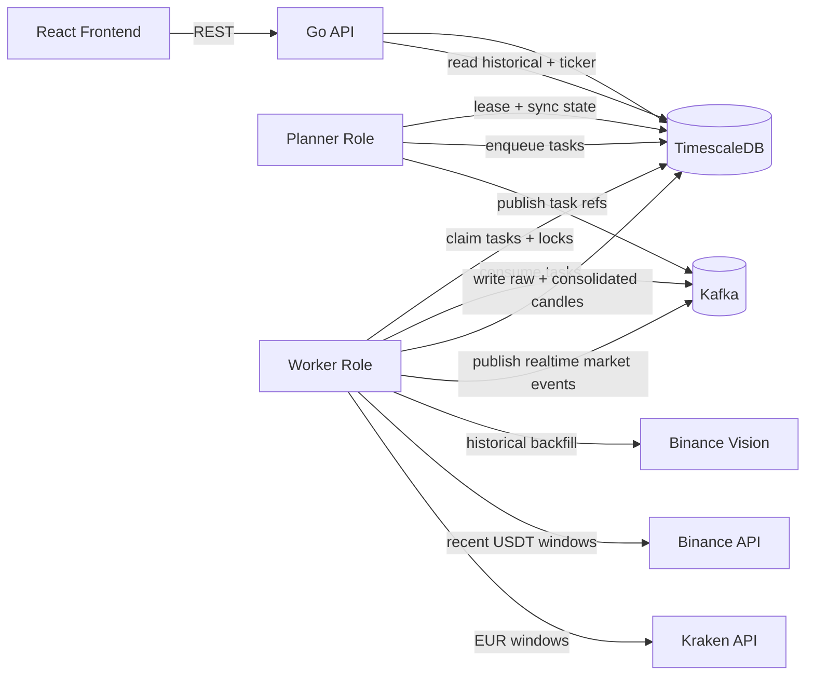

# Exchangely

Exchangely is an event-driven crypto market data platform focused on historical OHLCV availability for a curated set of crypto/fiat and crypto/stablecoin pairs.

## Current Scope

- Go backend scaffold with REST API, planner, worker, and health wiring
- React frontend scaffold with basic API consumption
- Kafka and TimescaleDB local development topology via Docker Compose
- OpenAPI contract and SQL migration placeholders

## Architecture Summary

- The backend runs as a single binary with API, planner lease management, and worker loops.
- PostgreSQL/TimescaleDB is the source of truth for leases, sync state, and candle storage.
- Kafka distributes task events and market events.
- Workers enforce per-pair exclusivity with database-backed locking semantics.

## Architecture Diagram

## Quick Start

1. Copy `.env.example` to `.env` and adjust values if needed.
2. Run `docker compose up --build`.
3. Open the frontend at `http://localhost:5173`.
4. Open the backend API at `http://localhost:8080/api/v1/health`.

## Development

- `make fmt` formats Go sources.
- `make test` runs backend tests.
- `make e2e` starts the Compose backend stack and runs the smoke e2e suite.
- `make up` starts local infrastructure.
- `make down` stops local infrastructure.

## Runtime Notes

- Backend logs use structured `log/slog` output.
- Backend defaults to `info` logging; set `BACKEND_LOG_LEVEL=debug` when you need planner tick and deeper source-debug noise.
- `docker compose logs -f backend` should now show:
  - process start and stop
  - HTTP access logs
  - planner leadership and scheduled tasks
  - worker claim and completion events
  - ingestion source activity and rate-limit/fallback status
- CORS is configurable via `BACKEND_CORS_ALLOWED_ORIGINS`.
  - in development it defaults to `http://localhost:5173,http://127.0.0.1:5173`
  - in non-development environments it defaults to disabled unless explicitly configured
