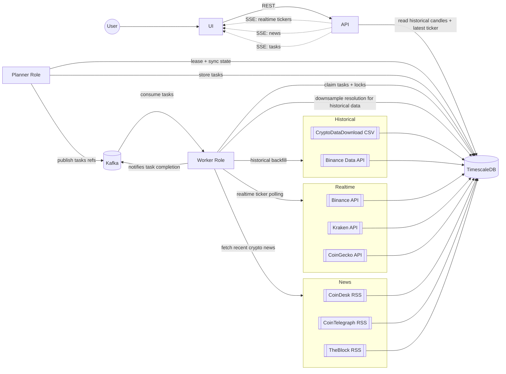

# Exchangely

Exchangely is an event-driven crypto market data platform focused on historical OHLCV availability for a curated set of crypto/fiat pairs.

## Disclaimer

This project is being built for educational purposes only. It is not intended for use in any production environment.

## Architecture

Historical series and live ticker are now intentionally decoupled. Historical backfill walks
backwards from yesterday into the past with no fixed start date, fetching the most recent
data first so charts are useful immediately. Live ticker starts immediately per pair with
at most one task in the queue at a time; once a worker completes a ticker task, the next
planner tick re-enqueues it. A daily backfill probe extends each pair one hour further
into the past to discover newly available upstream data.

## Features

- **Historical OHLCV**: Automated backfill and gap management for hourly and daily resolutions.
- **Real-time Dashboards**: Live ticker updates via SSE (Server-Sent Events).
- **Market News**: Curated news feed from major industry sources (CoinDesk, Cointelegraph, TheBlock).
- **Operations Center**: Coin-grouped coverage view showing live feed health and historical backfill status per base asset, real-time task monitoring, and system health warnings.

## Configuration

The following environment variables can be used to tune the system:

- `BACKEND_ROLE`: Comma-separated list of roles (`api,planner,worker`). Default: `all`.
- `BACKEND_REALTIME_POLL_INTERVAL`: How often the planner emits realtime ticker tasks per pair (e.g., `5s`, `30s`). Default: `5s`.
- `BACKEND_PLANNER_BACKFILL_BATCH_PERCENT`: Percentage of worker batch size allocated to backfill tasks per planner tick. Default: `50`.
- `BACKEND_WORKER_BACKFILL_BATCH_PERCENT`: Percentage of worker batch size allocated to backfill tasks per worker poll. Default: `50`.
- `BACKEND_NEWS_FETCH_INTERVAL`: Frequency of news updates (e.g., `5m`, `1h`). Default: `5m`.
- `DATABASE_URL`: TimescaleDB connection string.
- `KAFKA_BROKERS`: List of Kafka broker addresses.

## Quick Start

1. Copy `.env.example` to `.env` and adjust values if needed.
2. Run `docker compose up --build`.
3. Open the frontend at `http://localhost:5173`.
4. Open the backend API at `http://localhost:8080/api/v1/health`.
