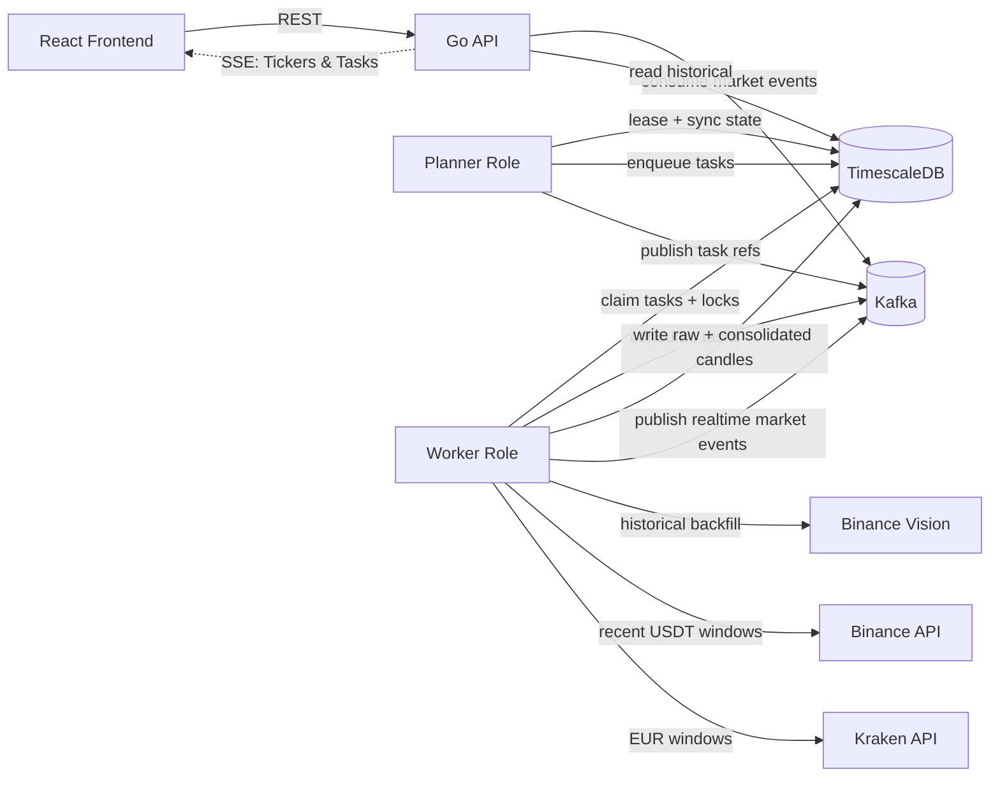

# Exchangely

Exchangely is an event-driven crypto market data platform focused on historical OHLCV availability for a curated set of crypto/fiat and crypto/stablecoin pairs.

## Disclaimer

This project is being built for educational purposes only. It is not intended for use in any production environment.

## Architecture

## Quick Start

1. Copy `.env.example` to `.env` and adjust values if needed.
2. Run `docker compose up --build`.
3. Open the frontend at `http://localhost:5173`.
4. Open the backend API at `http://localhost:8080/api/v1/health`.

